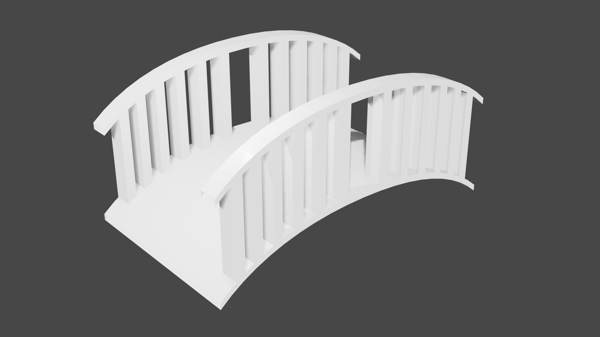
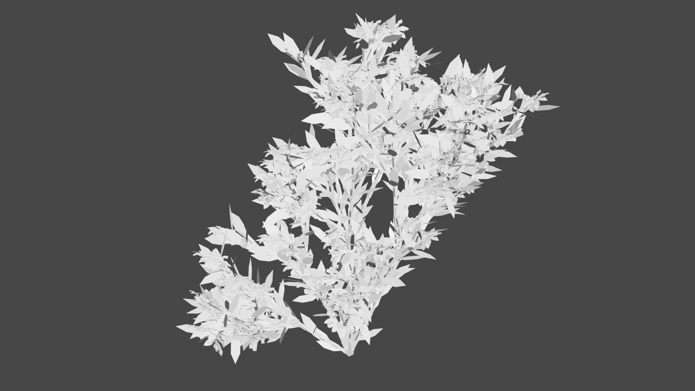
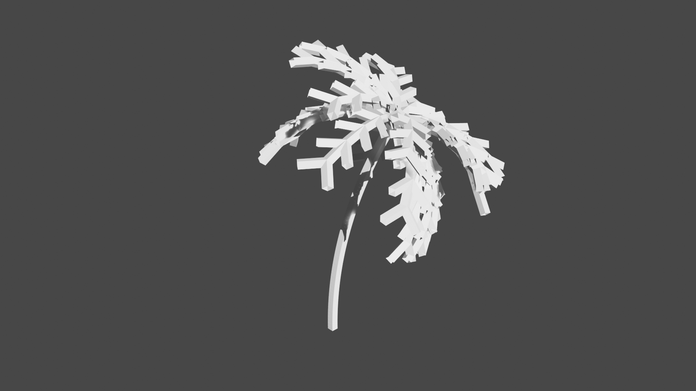

Various Modelling Techniques Implemented in Blender
===

This is my solution to the first assignment of the course ["Sistemas Gráficos 3D"](http://lvelho.impa.br/i3d19/). The code can be found in
[dccsillag/blender-modelling-techniques](https://github.com/dccsillag/blender-modelling-techniques).
The idea was to create elements that would be present in a garden.

 - [Rocks](#rocks) (Implicit functions with skeleton primitives)
 - [Bridges](#bridges) (Union of parametric functions based on a 2D quadratic Bezier Curve)
 - [Bushes](#bushes) (3D Stochastic L-System with flowers externally modelled)
 - [Trees](#trees) (3D Parametric L-System)
 - [Palm Trees](#palm-trees) (3D Parametric Stochastic L-System)
 - [Vases](#vases) (Surfaces of revolution based on a 2D Bezier Curve of any degree)
 - [Controlled Plants](#controlled-plants) (A special symbol for use with L-Systems to introduce better control over shape is proposed)

## Rocks


The rocks above were generated by creating an implicit surface using elliptical skeleton primitives, polygonized by an adaptive Marching Cubes algorithm with interval arithmetic.

We want to construct some implicit function $f : \mathbb{R}^3 \rightarrow \mathbb{R}$ such that $f^{-1}(0) = \{ x \in \mathbb{R}^3 \mid f(x) = 0 \}$.
A quite common way of constructing such functions is by blending skeleton primitives, which constitute of a radius $r_i$ and a distance function
$d_i : \mathbb{R}^3 \rightarrow \mathbb{R}^+$, applied to a field function $g : \mathbb{R} \rightarrow \mathbb{R}$.
The blending operation is then the sum of the field function applied to the distance functions, thus making our desired function

$$f(x) = \sum_i g(d_i(x)) - \sigma,$$

Where $g : \mathbb{R}^+ \rightarrow \mathbb{R}$ is the field function, the $d_i : \mathbb{R}^3 \rightarrow \mathbb{R}^+$ (for $i = 1, 2, \dots, n$) are the distance functions and $\sigma$ is the isovalue.

If we wanted to have spheres as our skeleton primitives, we could only use the distance function

$$d(p) = \lVert p - c \rVert = d(x, y, z) = \sqrt{(x - c_x)^2 + (y - c_y)^2 + (z - c_z)^2},$$

With $r$ (passed to the field function) being the sphere radius. However, in order to model ellipses, we have to use another $d$, such as

$$d(x, y, z) = \sqrt{(x/r_x - c_x)^2 + (y/r_y - c_y)^2 + (z/r_z - c_z)^2},$$

With $\max \{r_x, r_y, r_z\}$ being passed to the field function.

There are many possibilities for $g$:

 - $g(d) = \exp(-r_i d^2)$
 - $g(d) = 1 - 4d^6/9r^6 + 17d^4/9r^4 - 22d^2/9r^2$
 - $g(d) = (1- d^2/r^2)^3$

The one chosen was Blinn's Gaussian function:

$$g(d) = \exp(-r_i d^2).$$

The isovalue clearly cannot be $\sigma = 0$, since then the function is always positive - we use $\sigma = 1$ instead.

The parameters necessary for the generating the implicit function are:

 - Minimum radius (x, y, z);
 - Maximum radius (x, y, z);
 - Number of metaballs.

Each metaball is then defined as:

 - $r_x = \mathrm{random}(\min r_x, \max r_x)$
 - $r_y = \mathrm{random}(\min r_y, \max r_y)$
 - $r_z = \mathrm{random}(\min r_z, \max r_z)$
 - $r_{\max} = \max {r_x, r_y, r_z}$
 - $c_x = \mathrm{random}(p_x - \max r_x + r_x, p_x + \max r_x - r_x)$
 - $c_y = \mathrm{random}(p_y - \max r_y + r_y, p_y + \max r_y - r_y)$
 - $c_z = \mathrm{random}(p_z - \max r_z + r_z, p_z + \max r_z - r_z)$

Where $r_x$, $r_y$, $r_z$ are the radii of the ellipses, $r_{\max}$ is passed to the field function, $c_x$, $c_y$, $c_z$ are the coordinates for
the center of the ellipses, and $p_x$, $p_y$, $p_z$ are the center of the desired rock.

Finally, in order to generate vertices and faces that approximate $f^{-1}(0)$ sufficiently well, we use a divide-and-conquer approach. Given an initial interval in $\mathbb{R}^3$,
we use an octree to isolate where the surface is, and when we are sufficiently deep, using a lookup table (with 256 cases) we see which edges of the current cell that has some $f(x) = 0$.
Then, interpolating linearly with $f$ itself, we can approximate triangle (s) for that cell.

In order to check whether the surface passes through a box in $\mathbb{R}^3$, we use interval arithmetic. This way, to check if $f^{-1}(0)$ goes through $[a_x, b_x] \times [a_y, b_y] \times [a_z, b_z]$,
we calculate $f([a_x, b_x], [a_y, b_y], [a_z, b_z]) = [a, b]$ and check if $0 \in [a, b]$ (if $a \leq 0 \leq b$). This guarantees that we are not skipping any part of the surface, as might happen if we
had just considered the values of $f$ on the box's vertices (ignoring when checking the lookup table).

## Bridges



The bridges are generated by a set of parametric objects, given by functions $f : [0, 1] \times [0, 1] \rightarrow \mathbb{R}^3$. They are defined with the following parameters:

 - Bridge width;
 - Bridge length;
 - Bridge height;
 - Bridge thickness;
 - Whether to add railings;
 - Railing height;
 - Railing width;
 - Number of railing posts;

To polygonize the models, we simply iterate over $u$ and $v$ according to some `u_step` and `v_step`.

Using the parameters above, we define a quadratic 2D Bezier curve:

$$B(t) = (1-t)^2 P_0 + 2(1-t)t P_1 + t^2 P_2$$

With

$$P_0 = (\mathrm{length}, 0),$$
$$P_1 = (\mathrm{random}(0.1\cdot\mathrm{length}, 0.5\cdot\mathrm{length}), \mathrm{height}),$$
$$P_2 = (0, \mathrm{height}).$$

This Bezier curve is used to construct the bridge (mirroring the curve over its middle), along with the railings.

## Bushes



A L-System is defined by an axiom and a set of replacement rules. Then, for each step, we go over the current axiom and replace each symbol with the corresponding replacement rule.

In order to draw things using L-Systems, a common approach is to use turtle graphics. The idea is that you have a "turtle," which can respond to some basic instructions (in 2D):

| Symbol |                                Action |
|:-------|--------------------------------------:|
| `F`    |        Walk forward, drawing the path |
| `f`    | Walk forward, but don't draw the path |
| `+`    |                             Turn left |
| `-`    |                            Turn right |

In 3D, we have:

| Symbol |                                Action |
|:-------|--------------------------------------:|
| `F`    |        Walk forward, drawing the path |
| `f`    | Walk forward, but don't draw the path |
| `+`    |                              Yaw left |
| `-`    |                             Yaw right |
| `&`    |                            Pitch down |
| `^`    |                              Pitch up |
| `\`    |                             Roll left |
| `/`    |                            Roll right |

In order to branch out, it is also useful to define two more symbols:

| Symbol |                Action |
|:-------|----------------------:|
| `[`    | Push turtle to stack  |
| `]`    | Pop turtle from stack |

Example:

$$\begin{array}{cclcc}
\omega & : & \mathtt{F} \\
p_0    & : & \mathtt{F} & \xrightarrow{} & \mathtt{F[+F]}
\end{array}$$

| Step |                            Axiom                                |
|:-----|:---------------------------------------------------------------:|
| 0    | `F`                                                             |
| 1    | `F[+F]`                                                         |
| 2    | `F[+F][+F[+F]]`                                                 |
| 3    | `F[+F][+F[+F]][+F[+F][+F[+F]]]`                                 |
| 4    | `F[+F][+F[+F]][+F[+F][+F[+F]]][+F[+F][+F[+F]][+F[+F][+F[+F]]]]` |

Using these alphabets given above will result in always generating the exact same string of instructions. To overcome this, we use Stochastic L-Systems, in which
each instruction has a probability of being used, with all the instructions for the same symbol's probability adding up to one. This usually also adds a higher
feeling of naturality to the drawn object.

---

The bushes in the images were all generated using the following Stochastic L-System:

$$\begin{array}{cclcl}
\omega & : & \mathtt{A} \\
p_0'   & : & \mathtt{A} & \xrightarrow{0.34} & \mathtt{[\&FLA]/////[\&FLA]///////[FBA]} \\
p_0''  & : & \mathtt{A} & \xrightarrow{0.33} & \mathtt{[\&LA]/////[\&FLA]///////[FBA]} \\
p_0''' & : & \mathtt{A} & \xrightarrow{0.33} & \mathtt{[\&FLA]/////[\&LA]} \\
p_1    & : & \mathtt{F} & \xrightarrow{}     & \mathtt{S/////F} \\
p_2    & : & \mathtt{S} & \xrightarrow{}     & \mathtt{FL} \\
p_3    & : & \mathtt{L} & \xrightarrow{}     & \mathtt{[ \wedge \wedge \{-f+f+f-|-f+f+f \}]} \\
p_4    & : & \mathtt{B} & \xrightarrow{}     & \mathtt{[-Fb]}
\end{array}$$

With the alphabet

| Symbol |                                                       Action |
|:-------|-------------------------------------------------------------:|
| `F`    |                               Walk forward, drawing the path |
| `f`    |                        Walk forward, but don't draw the path |
| `+`    |                                                     Yaw left |
| `-`    |                                                    Yaw right |
| `&`    |                                                   Pitch down |
| `^`    |                                                     Pitch up |
| `\`    |                                                    Roll left |
| `/`    |                                                   Roll right |
| `|`    |                                                  Turn around |
| `[`    |                                        Push turtle to stack  |
| `]`    |                                        Pop turtle from stack |
| `{`    |                                      Start drawing a polygon |
| `}`    |                                     Finish drawing a polygon |
| `A`    |                                                 Dummy symbol |
| `B`    |                                                 Dummy symbol |
| `S`    |                                                 Dummy symbol |
| `L`    |                                                 Dummy symbol |
| `b`    | A flower heading the turtle's direction, from `magnolia.obj` |

## Trees


Parametric L-Systems are a slight variation of normal L-Systems in which we associate parameters with the symbols in our alphabet.

The trees we wish to model have a trunk, from which branches grow out from. The trunk's and branch's lengths vary proportionally,
trunk according to a constant $r_1$, and the branches to a constant $r_2$. Branches also extrude from the trunk with an angle of $a_0$
and from another branch with an angle of $a_2$. Finally, the trunk rolls as per a constant $d$, so that we branch out in different directions.

Using all this information, we elaborate a Parametric L-System:

$$\begin{array}{cclcl}
\omega & : & \mathtt{A_{1,10}} \\
p_0    & : & \mathtt{A_{l,w}} & \xrightarrow{} & \mathtt{F_\mathit{l}[\&_\mathit{a_0}B_\mathit{lr_2, ww_r}]/_\mathit{d}A_\mathit{lr_1, ww_r}} \\
p_1    & : & \mathtt{B_{l,w}} & \xrightarrow{} & \mathtt{F_\mathit{l}[-_\mathit{a_2}$C_\mathit{lr_2, ww_r}]C_\mathit{lr_1, ww_r}} \\
p_2    & : & \mathtt{C_{l,w}} & \xrightarrow{} & \mathtt{F_\mathit{l}[+_\mathit{a_2}$B_\mathit{lr_2, ww_r}]B_\mathit{lr_1, ww_r}} \\
\end{array}$$

With the following alphabet:

| Symbol |                                                  Action |
|:-------|--------------------------------------------------------:|
| `F`    |                          Walk forward, drawing the path |
| `f`    |                   Walk forward, but don't draw the path |
| `+`    |                                                Yaw left |
| `-`    |                                               Yaw right |
| `&`    |                                              Pitch down |
| `^`    |                                                Pitch up |
| `\`    |                                               Roll left |
| `/`    |                                              Roll right |
| `$`    | Roll the turtle so that the `left` vector is horizontal |
| `[`    |                                   Push turtle to stack  |
| `]`    |                                   Pop turtle from stack |
| `A`    |                                            Dummy symbol |
| `B`    |                                            Dummy symbol |
| `C`    |                                            Dummy symbol |

## Palm Trees



Palm trees are composed of a trunk, which is usually slightly curved because of the way it grew, and leaves, which have a main line, and branches out symmetrically.
The leaves can stack one on top of the other, and shorter leaves are angled higher up due to gravity.

Based on these observations, we formulate a Parametric Stochastic L-System, with some parameters:

 - $d$: iterations for generating the string of instructions
 - $n$: Number of leaves

$$\begin{array}{cclclr}
\omega & : & \mathtt{T_\mathrm{trunk\ length}C_\mathrm{number\ of\ leaves}} \\
p_0    & : & \mathtt{T_\mathit{l}} & \xrightarrow{}     & \mathtt{T_\mathit{l/2}-_\mathit{\theta/2^d}T_\mathit{l/2}} \\
p_1    & : & \mathtt{C}             & \xrightarrow{}     & \mathtt{-_{\mathrm{random}\mathit{(0, 2\pi)}}[L]} & \mathrm{repeated\ \mathit{n}\ times} \\
p_2'   & : & \mathtt{L} & \xrightarrow{0.33} & \mathtt{\&\&F[+++F][---F]l} \\
p_2''  & : & \mathtt{L} & \xrightarrow{0.33} & \mathtt{F[+++F][---F]l} \\
p_2''' & : & \mathtt{L} & \xrightarrow{0.34} & \mathtt{\wedge \wedge \wedge l} \\
p_3    & : & \mathtt{l} & \xrightarrow{}     & \mathtt{\&F[+++F][---F]l}
\end{array}$$

With the alphabet

| Symbol |                                                                  Action |
|:-------|------------------------------------------------------------------------:|
| `F`    |                                          Walk forward, drawing the path |
| `f`    |                                   Walk forward, but don't draw the path |
| `+`    |                                                                Yaw left |
| `-`    |                                                               Yaw right |
| `&`    |                                                              Pitch down |
| `^`    |                                                                Pitch up |
| `\`    |                                                               Roll left |
| `/`    |                                                              Roll right |
| `[`    |                                                   Push turtle to stack  |
| `]`    |                                                   Pop turtle from stack |
| `T`    |                                                            Dummy symbol |
| `C`    |                                                            Dummy symbol |
| `L`    |                                                            Dummy symbol |
| `l`    |                                                            Dummy symbol |

## Bowls / Vases


These bowls and vases are surfaces of revolution, based on a Bezier curve of degree $n$.

The curve $b_n : [0, 1] \rightarrow \mathbb{R}^2$ is first mapped to $\mathbb{R}^3$ by defining

$$B_n(t) = \left(b^{(0)}_n(t), 0, b^{(1)}_n(t)\right).$$

Then, we simply rotate $B_n(t)$ along the Z axis by $\theta = 0, 2\pi/n, \dots, 2\pi - 2\pi/n$, and create faces using the neighbors:

$$R_{\theta} B_n(t) = \left(b^{(0)}_n(t) \cos \theta, b^{(0)}_n(t) \sin \theta, b^{(1)}_n(t)\right).$$

## Controlled Plants


One major flaw of using L-Systems to model things such as plants is that the output you'll get usually isn't obvious; by simply looking at a L-System,
you can't really tell what it's going to do, unless you understand what the idea behind it was.

Suppose that, in a game, we intend to build a level in which the player has to walk on a branch of a giant tree that leads to some landmark. It would be madness to
randomly generate trees, until one of them has such a branch - particularly since the level designer would feel disregarded due to his lack of input.
One solution to this problem is to somehow describe to the tree generator that there must be a branch that goes in that direction - and perhaps even a basic idea
of how the whole tree's structure should be like (direction it goes in, where it branches out, etc.).

Ideally, we want to create something that could fit into the L-System for any tree. In particular, we can create a symbol that considers what to do based on input data.
Our data is a tree of points - when one of this tree's nodes have more than one child, we want the generated tree to branch out in the direction of both of the children;
If there are no children, then we should ignore the symbol and continue as normal; and finally, if there is only one child, then force the turtle in that direction.

Instead of using only one turtle, we can make branching easier by considering a set of turtles. This way, the algorithm essentially becomes:

```python
for each (node, turtle):
    children = node.children

    if len(children) == 0:
        # Reset step size for `turtle`
        continue

    if (turtle.position - node).length <= eps:
        for child in children:
            new_direction = child - turtle.position

            new_turtle = copy(turtle)
            new_turtle.direction = new_direction.normalized()
            # Rotate the left and up vectors accordingly
            new_turtle.step_size = c * new_direction.length

            new_turtles.append(new_turtle)
            new_data.append(child)
    else:
        new_direction = node - turtle.position

        new_turtle = copy(turtle)
        new_turtle.direction = new_direction.normalized()
        # Rotate the left and up vectors accordingly
        new_turtle.step_size = c * new_direction.length

        new_turtles.append(new_turtle)
        new_data.append(node)
```

It is important to set the step size for the turtle, to reinforce it's path, even if it is not uniformly distributed, and it is also quite useful to return the step size
back to the original after there are no more children for the turtle to follow.

The oddly curved palm tree in the image was generated using pretty much the same L-System as the one in [the palm tree section](#palm-trees):

$$\begin{array}{cclclr}
\omega & : & \mathtt{TC_\mathrm{number\ of\ leaves}} \\
p_0    & : & \mathtt{T} & \xrightarrow{}     & \mathtt{T?T} \\
p_1    & : & \mathtt{C} & \xrightarrow{}     & \mathtt{-_{\mathrm{random}\mathit{(0, 2\pi)}}[L]} & \mathrm{repeated\ \mathit{n}\ times} \\
p_2'   & : & \mathtt{L} & \xrightarrow{0.33} & \mathtt{\&\&F[+++F][---F]l} \\
p_2''  & : & \mathtt{L} & \xrightarrow{0.33} & \mathtt{F[+++F][---F]l} \\
p_2''' & : & \mathtt{L} & \xrightarrow{0.34} & \mathtt{\wedge \wedge \wedge l} \\
p_3    & : & \mathtt{l} & \xrightarrow{}     & \mathtt{\&F[+++F][---F]l}
\end{array}$$

With the alphabet

| Symbol |                                                                  Action |
|:-------|------------------------------------------------------------------------:|
| `F`    |                                          Walk forward, drawing the path |
| `f`    |                                   Walk forward, but don't draw the path |
| `+`    |                                                                Yaw left |
| `-`    |                                                               Yaw right |
| `&`    |                                                              Pitch down |
| `^`    |                                                                Pitch up |
| `\`    |                                                               Roll left |
| `/`    |                                                              Roll right |
| `[`    |                                                   Push turtle to stack  |
| `]`    |                                                   Pop turtle from stack |
| `T`    |                                                            Dummy symbol |
| `C`    |                                                            Dummy symbol |
| `L`    |                                                            Dummy symbol |
| `l`    |                                                            Dummy symbol |
| `?`    |               Consider the data to guide the turtle in the input's path |

And its structure was given by the quartic Bezier Curve given by the points $(0, 0, 0)$, $(5, 0, 0)$, $(5, 0, 5)$ and $(0, 0, 5)$.

With this method, other parameters can also be controlled without much hassle, such as branch radii, step angles and tropisms.
